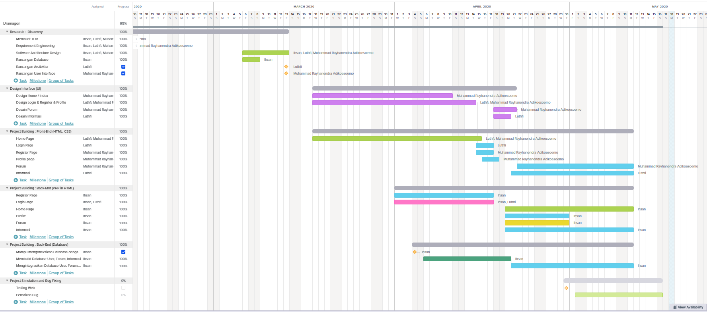

# Dramagon

Hi! **Dramagon** adalah aplikasi berbasis web yang memberikan berbagai macam bentuk informasi seputar kabupaten Dramaga, Bogor. 

## Kelompok 11 P2
Anggota:
1. Luthfi Fachruddin (G64180025)
2. Ihsan Firdaus (G64180054) (Ketua)
3. M. Rayhanendra Adikoesoemo (G64180098)

# Latar Belakang

Kecamatan Dramaga di Bogor Jawa Barat, merupakan sebuah wilayah yang cukup
banyak dihuni oleh warga, baik itu warga lokal maupun warga pendatang baru. Hal ini karena
di Dramaga terdapat sebuah kampus ternama yaitu, IPB University, sehingga setiap tahunnya
pasti ada mahasiswa pendatang baru. Permasalahan yang sering dialami oleh warga dan
pendatang baru adalah ketidaktahuan tentang informasi tentang hal-hal yang ada di Dramaga.
Sebagai contoh, banyak orang yang kesulitan mencari tempat seperti warkop, warung, jasa
laundry, penyedia kost, pasar tradisional ataupun tempat lainnya. Disamping itu, para pemilik
tempat dan pemilik usaha juga kesulitan memberi informasi kepada khalayak, yang
menyebabkan ketidaktahuan warga dan pendatang baru dan berakibat sepinya pengunjung.
Para warga dan pendatang baru juga terkadang ingin menginfokan tempat kepada kita. Untuk
itu, diperlukan sebuah aplikasi yang menampung semua hal yang ada di dramaga. Maka dari
itu kelompok kami mengembangkan **Dramagon**, yaitu sebuah web forum yang dikhususkan
untuk masyarakat Dramaga.

# Tujuan

1. Memudahkan warga dan pendatang baru untuk mencari tempat dan hal lainnya yang
ada di dramaga.
2. Membantu pemilik usaha dalam menginformasikan tempat dan usahanya kepada
orang lain.
3. Membuat dramaga sebagai wilayah yang berbasis smart city yang bisa dikenali secara
cepat oleh warganya.
4. Memudahkan warga dan pendatang baru di Dramaga untuk berdiskusi mengenai topik tertentu.

# Ruang Lingkup

- Perencanan dan Persiapan Pelaksanaan Kegiatan
Kegiatan perencanaan meliputi perkiraan kebutuhan akan aplikasi yang akan dibuat
dan dikembangkan sehingga dapat memahami permasalahan utama dan mendefinisikannya
secara rinci untuk dituangkan ke dalam rancangan aplikasi serta pembuatan jadwal
pelaksanaan yang memuat tahapan pekerjaan dimana tahapan tersebut akan dilakukan.

- Perancangan Sistem
Lamaan aplikasi Dramagon didesain dengan menggunakan pendekatan desain web.

- Pelaksanaan Kegiatan
Pelaksanaan kegiatan meliputi pembuatan aplikasi sesuai dengan hasil riset yang kami lakukan sebelum memulai membentuk aplikasi, dalam rangka mencari keinginan pengguna.
Proyek aplikasi ini dikerjakan dalam ruang lingkup wilayah Dramaga, dimana terdapat
komponen pemetaan wilayah dan pengguna yang beraneka ragam. Pemilihan daerah
Kecamatan Dramaga untuk lamaan ini bertujuan karena kurangnya tempat media promosi
dan juga kurangnya sumber informasi mengenai wilayah tersebut.

# Deskripsi Perangkat Lunak

**Dramagon** merupakan sebuah web forum yang dikhususkan untuk wilayah Dramaga.
**Dramagon** dikembangkan karena kurangnya sumber informasi tentang Dramaga bagi
pendatang baru dan kurangnya media promosi di kawasan Dramaga menjadi alasan
dikembangkannya **Dramagon**. Dengan adanya **Dramagon**, masyarakat lebih mudah mendapat
dan berbagi informasi tentang Dramaga.
**Dramagon** memiliki fitur forum yang berfungsi sebagai tempat diskusi masyarakat
dramaga tentang berbagai hal, terutama para mahasiswa baru yang belum mengetahui seluk
beluk Dramaga. Hal-hal yang sering dipertanyakan oleh para mahasiswa baru seperti mencari
kost saat lulus dari Asrama PPKU IPB, mencari tempat untuk rapat ormawa, dan hal-hal
lainnya yang dibutuhkan oleh para mahasiswa di sekitar Dramaga. Dramagon juga memiliki
fitur informasi yang berfungsi untuk menyebarluaskan info-info penting yang ada di sekitar
Dramaga, seperti event kampus, tempat nongkrong yang baru buka, atau jasa & service yang ada,  info tempat makan, info kost, info warkop, dan lain sebagainya. Dengan adanya **Dramagon**, diharapkan dapat menjadi jembatan penghubung bagi masyarakat
Dramaga untuk bersosialisasi, bertransaksi, dan bertukar informasi satu sama lain.

# User Profile
Aplikasi ini ditujukan untuk warga dramaga yang ingin mengetahui beraneka ragam informasi seputar dramaga. Yang didasari dari minimnya informasi seperti kemacetan, mencari toko, dan juga lapak-lapak baru yang bingung ingin mempromosikan lapaknya di dramaga.

# User Story
-Sebagai warga dramaga, saya ingin mencari tahu berita-berita penting seputar dramaga yang langsung dari sumber aslinya yaitu warga atau user.
-Sebagai warga dramaga, saya ingin bertanya-tanya banyak hal seputar lingkungan dramaga.
-Sebagai warga dramaga, saya ingin ...
-Sebagai warga dramaga, saya ingin ...

# Use Case Diagram

# Use Case Description

# Activity Diagram
Activity Diagram: Memasukan Akun

# Gantt Chart

# ERD

# Hasil Implementasi Perangkat Lunak
## Penjelasan Singkat
Kami telah membuat video berupa tampilan dari implementasi perangkat lunak yang telah kami buat. video ini menjadi bukti bahwa aplikasi kita sudah bisa dijalankan walau tidak maksimal. Kami berharap aplikasi kami bisa berguna kelak.

**Link Video**

